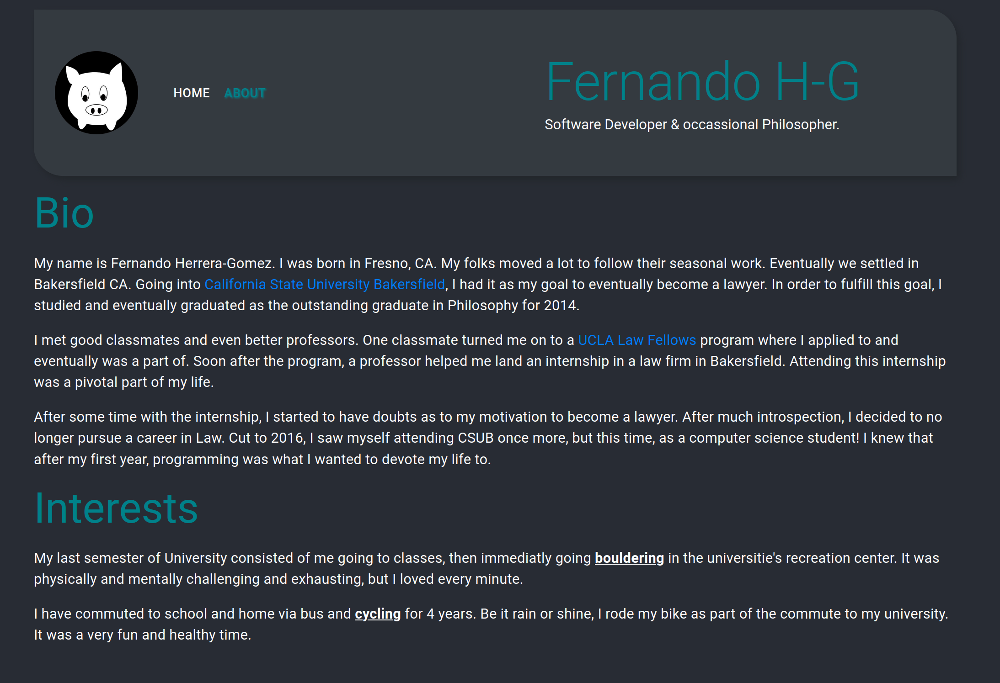
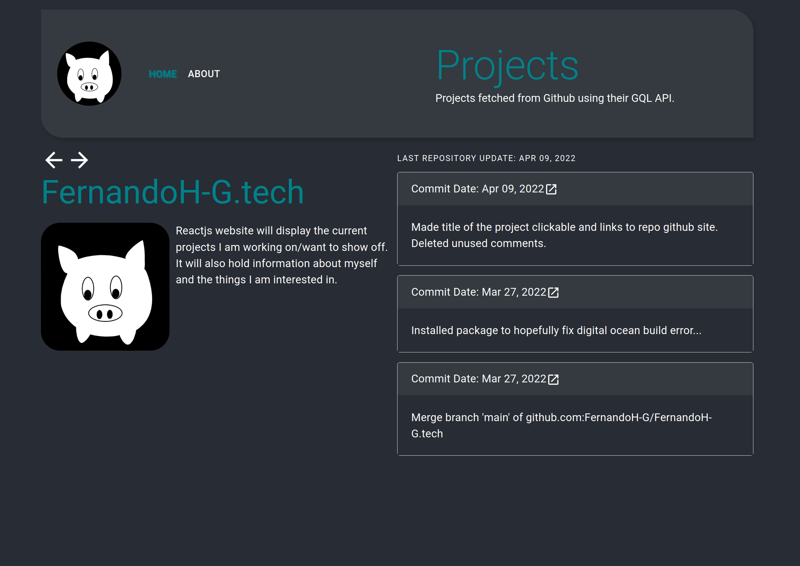

# FernandoH-G.tech

## Description
[FernandoH-G.tech](https://fernandoh-g.tech) will display the current projects I am working on/want to show off. 
It will also hold information about myself and the things I am interested in.

## Tech Goals
+ ReactJS - Make use of components, routing, and styling to make a presentable website.
+ React-Bootstrap/Reactstrap - Use bootstrap themeing to make mobile friendly site.
+ JS Apollo GQL - Use Apollo's js implementation to connect to my Github account via their GQL API.

## Academic Goals
+ Re-introduce myself to web development.
+ Work on modern web dev libraries.

## Future Plans
+ Improve visual appeal.
+ Add more page sections.
+ Integrate subscriptions on my projects page.

# Screenshots

 

